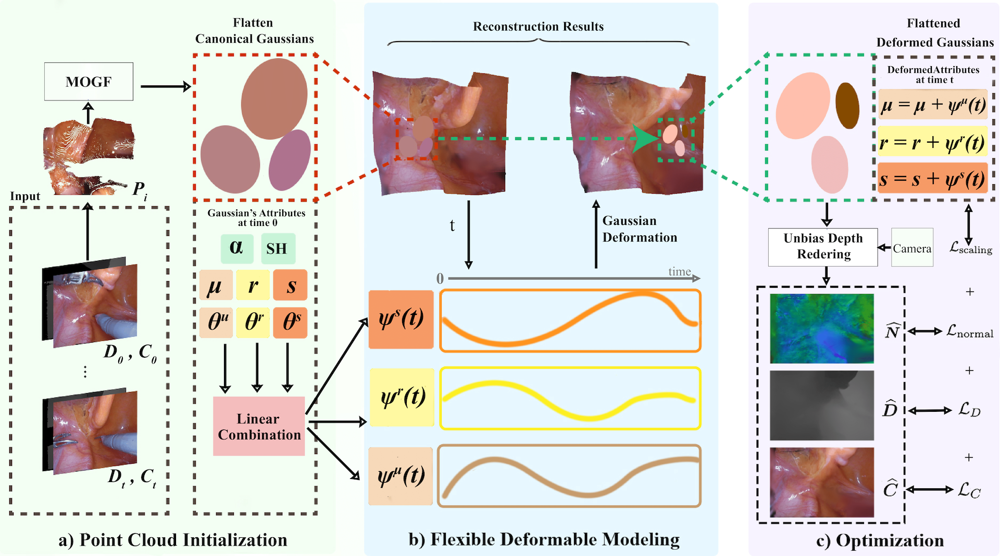

# EndoPlanar: Deformable Planar-based Gaussian Splatting for Surgical Scene Reconstruction

Official code implementation for EndoPlanar, a Planar based Gaussian Splatting based framework for surgical scene reconstruction.

> [EndoPlanar: Deformable Planar-based Gaussian Splatting for Surgical Scene Reconstruction]()\
> Thatphum Paonim, Chayapon Sasnarukkit, Natawut Nupairoj, and Peerapon Vateekul\
> Department of Computer Engineering, Faculty of Engineering, Chulalongkorn University, Bangkok 10330, Thailand


## Pipeline

<p align="center">
  
</p>

**EndoPlanar** consists of three main stages: (a) Point Cloud initialization, (b) Flexible Deformation Modeling, and (c) Unbiased Depth Rendering and Optimization. The approach consists of (a) Point cloud initialization using MOGF, (b) Flexible Deformation Modeling, and (c) Unbiased Depth Rendering. Experiments on EndoNeRF and StereoMIS datasets indicate the efficacy of our approach, showcasing superior reconstruction fidelity PSNR: (34.51) and rendering speed (307.5 FPS).

## Environment setup

Tested with NVIDIA RTX A5000 GPU.

```bash
git clone https://github.com/your-repo/EndoPlanar.git
cd EndoPlanar
conda create -n EndoPlanar python=3.7 
conda activate EndoPlanar
pip install torch==2.4.1 torchvision==0.19.1 torchaudio==2.4.1 --index-url https://download.pytorch.org/whl/cu118
pip install "git+https://github.com/facebookresearch/pytorch3d.git@stable"

pip install -r requirements.txt
pip install -e submodules/depth-diff-gaussian-rasterization
pip install -e submodules/simple-knn
```

## Datasets

We use 2 clips from [EndoNeRF](https://github.com/med-air/EndoNeRF) and 3 clips manually extracted from [StereoMIS](https://zenodo.org/records/7727692) to verify our method.

To use the two available examples in [EndoNeRF](https://github.com/med-air/EndoNeRF) dataset. Please download the data via [this link](https://forms.gle/1VAqDJTEgZduD6157) and organize the data according to the [guideline](https://github.com/med-air/EndoNeRF.git).

To use the [StereoMIS](https://zenodo.org/records/7727692) dataset, please follow this [github repo](https://github.com/aimi-lab/robust-pose-estimator) to preprocess the dataset. After that, run the provided script `stereomis2endonerf.py` to extract clips from the StereoMIS dataset and organize the depth, masks, images, intrinsic and extrinsic parameters in the same format as [EndoNeRF](https://github.com/med-air/EndoNeRF). In our implementation, we used [RAFT](https://github.com/princeton-vl/RAFT) to estimate the stereo depth for [StereoMIS](https://zenodo.org/records/7727692) clips. Following EndoNeRF dataset, this script only supports fixed-view settings.

The data structure is as follows:

```
data
| - endonerf_full_datasets
|   | - cutting_tissues_twice
|   |   | -  depth/
|   |   | -  images/
|   |   | -  masks/
|   |   | -  pose_bounds.npy 
|   | - pushing_soft_tissues
| - StereoMIS
|   | - stereo_seq_1
|   | - stereo_seq_2
```

## Training

To train EndoPlanar with customized hyper-parameters, please make changes in `arguments/endonerf/default.py`.

To train EndoPlanar, run the following example command:

```
python train.py -s data/endonerf_full_datasets/pulling_soft_tissues --expname endonerf/pulling_fdm --configs arguments/endonerf/default.py 
```

## Testing

For testing, we perform rendering and evaluation separately.

### Rendering

To run the following example command to render the images:

```
python render.py --model_path output/endonerf/pulling_fdm  --skip_train --reconstruct_test --configs arguments/endonerf/default.py
```

Please follow [EndoGaussian](https://github.com/yifliu3/EndoGaussian/tree/master) to skip rendering. Of note, you can also set `--reconstruct_train`, `--reconstruct_test`, and `--reconstruct_video` to reconstruct and save the `.ply` 3D point cloud of the rendered outputs for  `train`, `test` and`video` sets, respectively.

### Evaluation

To evaluate the reconstruction quality, run following command:

```
python metrics.py --model_path output/endonerf/pulling_fdm -p test
```

Note that you can set `-p video`, `-p test`, `-p train` to select the set for evaluation.


## Acknowledgements

This repo borrows some source code from [Deform3DGS](https://github.com/jinlab-imvr/Deform3DGS/tree/master), [EndoGaussian](https://github.com/yifliu3/EndoGaussian/tree/master), [4DGS](https://github.com/hustvl/4DGaussians), [depth-diff-gaussian-rasterizer](https://github.com/ingra14m/depth-diff-gaussian-rasterization), [3DGS](https://github.com/graphdeco-inria/gaussian-splatting), and [EndoNeRF](https://github.com/med-air/EndoNeRF). We would like to acknowledge these great prior literatures for inspiring our work.

Thanks to [EndoGaussian](https://github.com/yifliu3/EndoGaussian/tree/master) for their great and timely effort in releasing the framework adapting Gaussian Splatting into surgical scene.

## Citation

If you find this code useful for your research, please use the following BibTeX entries:

```
@misc{
}
```

### Questions

For further question about the code or paper, welcome to create an issue, or contact 'peerapon.v@chula.ac.th'